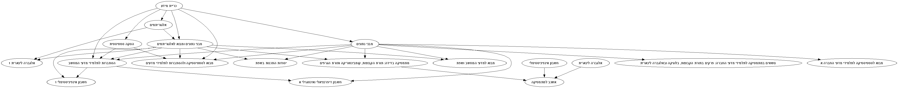
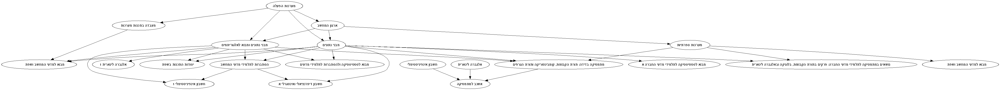

## Graph course dependencies

This is for people going to open university courses in Israel. If you use http://openu.ac.il this might be for you.

Otherwise, probably not.

## Usage

`bundle && bundle exec ruby graph_lessons 'http://www.openu.ac.il/courses/20595.htm'`

`bundle && bundle exec ruby graph_lessons 'http://www.openu.ac.il/courses/20594.htm'`

## You'll get

etc.

## What?

It works by parsing the html and looking for a clause like:

"תנאי קבלה: עמידה בדרישות האנגלית ובדרישות ההדרכה הביבליוגרפית בספרייה. ידע קודם דרוש: הקורס אנליזה נומרית 1, ואחד מבין הקורסים משוואות דיפרנציאליות רגילות 1, מבוא למשוואות דיפרנציאליות רגילות"

And just takes out the links it finds there. There's no semantics in the website, so it just gathers all the links there. If some are suggestions/optionals/whatever, it still counts it like a dependency course.

Hoping to fix it sometime in the future. Maybe you will. :)

## That's it

Yup.
